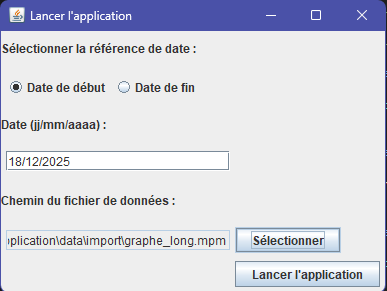
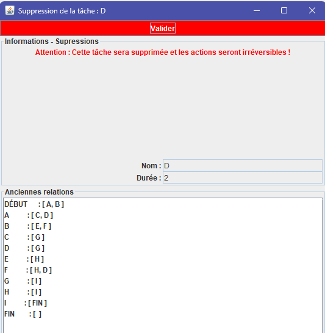

# Projet MPM
IUT Le Havre - Département Informatique  
Année 2024–2025  
SAÉ 2.01, 2.02, 2.05

## Présentation
Ce projet consiste en l'implémentation complète de la méthode MPM, utilisée pour la planification et l’ordonnancement de projets complexes.

Le programme propose :

- Une interface en ligne de commande (CUI) pour lire, analyser et afficher les tâches avec leurs dates au plus tôt, au plus tard, et les marges.
- Une interface graphique (GUI) représentant les tâches sous forme de graphe.
- Un simulateur GUI avec boutons interactifs pour voir le calcul progressif des dates.
- La mise en évidence du chemin critique.
- Des fonctionnalités additionnelles selon l’avenant.

### Aperçu de l'interface graphique





# Mode d'emploi

## Lancement du projet

### Méthode 1 : Run.sh (Linux/Mac)
```bash
chmod +x run.sh
./run.sh
```

### Méthode 2 : Commandes manuelles

#### Windows
```cmd
javac "@compile.list" -d class
cd class
java src.Controleur
```

#### Linux/Mac
```bash
javac @compile.list -d class
cd class
java src.Controleur
```

## Structure
- `src/`    : Code source Java
- `class/`  : Fichiers compilés (.class)
- `data/`   : Fichiers de données et sauvegardes
